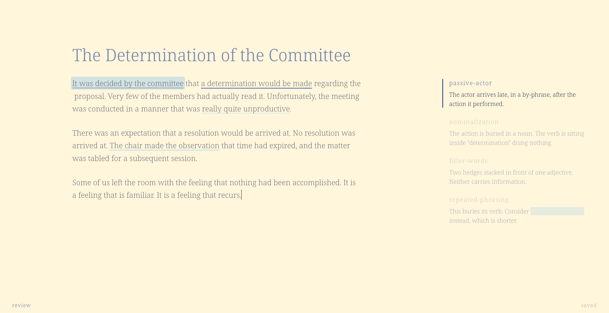
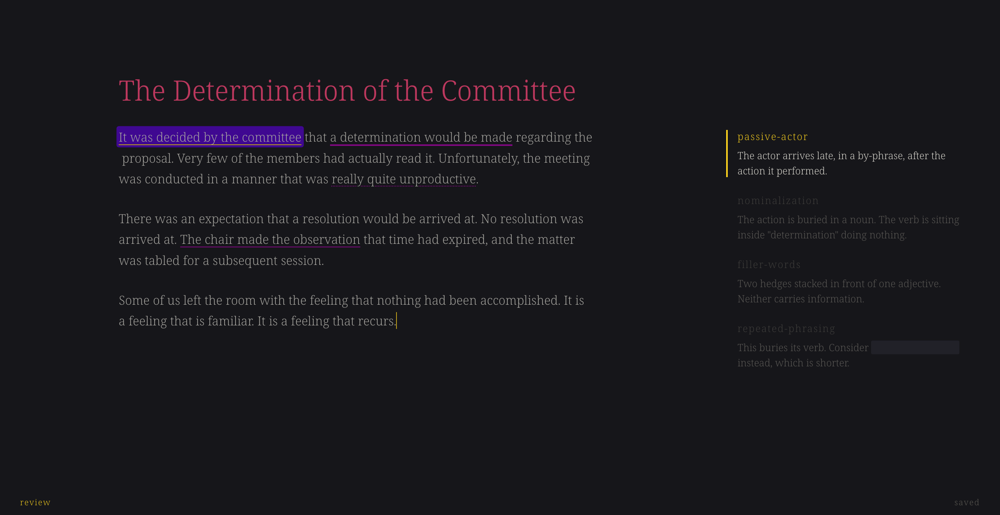

<p align="center">
  
</p>

# writegood

A desktop app that finds problems in your prose and refuses to fix them.

You write a draft. You run editing passes over it. Each pass is a prompt you
wrote. A model reads the draft and marks what it finds in the margin. You do
the rewriting.

<p align="center">
  
  
</p>

The idea comes from Thomas Ptacek's [*How To Write With An
LLM*](https://sockpuppet.org/blog/2026/09/17/how-to-write-with-an-llm/). The
app enforces his two rules:

- **No model words in your text.** There is no Accept button. A finding says
  where the problem is and what it is. It never gives you replacement text.
- **No praise.** An empty result says "no findings", not "looks great".

## Status

I built this for myself, and it shows. It runs on my Mac. It may run on
yours. Windows and Linux compile, as far as anyone knows. Nobody has
tested them.

Expect rough edges, missing features and the occasional lost afternoon. The
design is in [`SPEC.md`](./SPEC.md). The known gaps are in
[`DEVLOG.md`](./DEVLOG.md), and the list is not short.

## Running it

You need [Bun](https://bun.sh) and a Rust toolchain.

```
bun install
bun run app         # dev build
bun run app:build   # release .app
```

On first launch the app creates `~/.writegood` with a `config.toml` and nine
starter passes. Point `config.toml` at an API key in the keychain, an
environment variable or a `.env` file. Then press `⌘R` to run the passes.
`⌘K` opens everything else.

It works with Anthropic, OpenAI, Google and anything OpenAI-compatible. It can
also run passes through the `claude` or `codex` CLIs.

## Tests

```
bun test src/lib
cd src-tauri && cargo test
bun run e2e
```

None of them need a network or an API key. They pass, which is more than most
of the features can say.

## License

Not decided yet.
